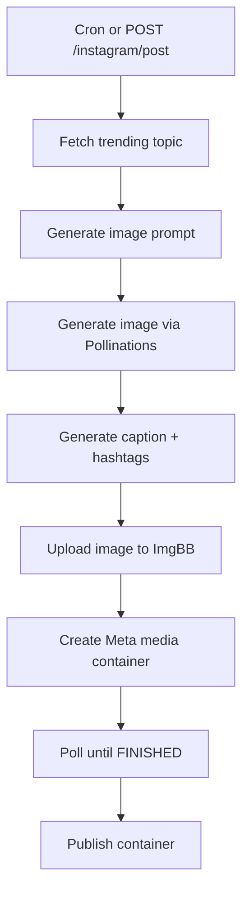

# Instagram Automation API

Production-ready NestJS backend that automates an Instagram content pipeline: discover trending topics with **Groq**, generate images, write captions and hashtags, schedule daily posts, and publish via the Meta Graph API.

## Features

- **Trending topics** — Groq LLM (`llama-3.3-70b-versatile` by default)
- **Image generation** — Pollinations API (1:1 Instagram-ready; configurable via `IMAGE_API_URL`)
- **Captions & hashtags** — Groq-generated copy in structured JSON
- **Scheduled posting** — Cron-based daily automation (`@nestjs/schedule`)
- **Manual posting** — REST endpoint to run the full pipeline on demand
- **Meta Graph API** — Two-step publish flow (media container → publish) with status polling
- **ImgBB bridge** — Public image URLs required by Meta; uploaded with retry logic

## Prerequisites

| Requirement | Details |
|-------------|---------|
| **Node.js** | v20 or later |
| **npm** | v9+ |
| **Meta Business** | Instagram Business or Creator account linked to a Facebook Page |
| **Meta Developer App** | With Instagram Graph API product enabled |
| **Groq** | Free API key from [console.groq.com](https://console.groq.com/keys) |
| **ImgBB account** | Free API key for temporary public image hosting |

## Project Structure

```
instagram-automation/
├── src/
│   ├── config/          # Environment configuration
│   ├── groq/            # Groq LLM + image generation
│   ├── trending/        # Trend discovery endpoints
│   ├── instagram/       # Meta Graph API + manual post trigger
│   ├── scheduler/       # Cron job & pipeline orchestration
│   └── common/          # Filters, interceptors, API response helpers
├── .env.example
├── package.json
└── README.md
```

## Setup

### 1. Clone and install

```bash
cd instagram-automation
npm install
```

### 2. Configure environment

```bash
cp .env.example .env
```

Edit `.env` with your API keys (see sections below).

### 3. Run the server

**Development (watch mode):**

```bash
npm run start:dev
```

**Production:**

```bash
npm run build
npm run start:prod
```

The API listens on `http://localhost:3000/api` by default.

---

## How to Get API Keys

### Groq API Key

1. Sign up at [Groq Console](https://console.groq.com)
2. Create an API key at [Keys](https://console.groq.com/keys)
3. Set `GROQ_API_KEY` in `.env`
4. Optional: change `GROQ_MODEL` (e.g. `llama-3.1-8b-instant`, `mixtral-8x7b-32768`) — see [Groq models](https://console.groq.com/docs/models)

### Image generation

Groq does not provide text-to-image. This project uses **Pollinations** by default (`IMAGE_API_URL`) — no extra API key. You can point `IMAGE_API_URL` to another compatible service if needed.

### Meta / Instagram Graph API

1. Create an app at [Meta for Developers](https://developers.facebook.com)
2. Add the **Instagram Graph API** product
3. Connect your Instagram Business/Creator account to a Facebook Page
4. Generate a **long-lived User Access Token** with permissions:
   - `instagram_basic`
   - `instagram_content_publish`
   - `pages_read_engagement`
5. Get your **Instagram Business Account ID**:
   ```bash
   curl "https://graph.facebook.com/v21.0/me/accounts?access_token=YOUR_TOKEN"
   ```
   Then query the connected Instagram account for the business account ID.
6. Set in `.env`:
   - `INSTAGRAM_ACCESS_TOKEN`
   - `INSTAGRAM_BUSINESS_ACCOUNT_ID`
   - `META_APP_ID`
   - `META_APP_SECRET`

### ImgBB API Key

1. Sign up at [ImgBB](https://imgbb.com)
2. Go to [API settings](https://api.imgbb.com/) after login
3. Copy your API key → `IMGBB_API_KEY`

---

## Postman Collection

Import files from [`postman/`](postman/):

- `Instagram-Automation.postman_collection.json`
- `Instagram-Automation.local.postman_environment.json`

See [`postman/README.md`](postman/README.md) for import steps and recommended test order.

---

## API Endpoints

All responses use this envelope:

```json
{
  "success": true,
  "data": {},
  "message": "Operation completed"
}
```

### Trending

| Method | Endpoint | Description |
|--------|----------|-------------|
| GET | `/api/trending` | All trending topics for configured niche |
| GET | `/api/trending/top` | Top trending topic only |

```bash
curl http://localhost:3000/api/trending
curl http://localhost:3000/api/trending/top
```

### Instagram

| Method | Endpoint | Description |
|--------|----------|-------------|
| POST | `/api/instagram/post` | Run full pipeline (optional topic/niche) |
| GET | `/api/instagram/status/:containerId` | Check Meta media container status |

```bash
# Auto topic from trending
curl -X POST http://localhost:3000/api/instagram/post \
  -H "Content-Type: application/json" \
  -d '{}'

# Specific topic
curl -X POST http://localhost:3000/api/instagram/post \
  -H "Content-Type: application/json" \
  -d '{"topic": "AI agents in 2026"}'

# Override niche
curl -X POST http://localhost:3000/api/instagram/post \
  -H "Content-Type: application/json" \
  -d '{"niche": "fitness"}'
```

---

## Scheduler (Cron)

Default: every day at **9:00 AM** (`Asia/Kolkata`).

| Variable | Example | Meaning |
|----------|---------|---------|
| `POST_CRON_TIME` | `0 9 * * *` | Daily at 9:00 AM |
| `POST_CRON_TIME` | `0 9,18 * * *` | 9 AM and 6 PM |
| `POST_CRON_TIME` | `0 9 * * 1-5` | Weekdays at 9 AM |
| `TIMEZONE` | `America/New_York` | Cron timezone |

Cron format: `minute hour day-of-month month day-of-week`

When the cron fires, the server logs `Cron job auto-instagram-post triggered` and runs the full pipeline automatically.

---

## Pipeline Flow



---

## Environment Variables

See [`.env.example`](.env.example) for the full list with comments.

| Variable | Required | Description |
|----------|----------|-------------|
| `GROQ_API_KEY` | Yes | Groq chat completions API |
| `GROQ_MODEL` | No | Default: `llama-3.3-70b-versatile` |
| `IMAGE_API_URL` | No | Default: Pollinations image API |
| `INSTAGRAM_ACCESS_TOKEN` | Yes | Meta long-lived token |
| `INSTAGRAM_BUSINESS_ACCOUNT_ID` | Yes | IG Business account ID |
| `IMGBB_API_KEY` | Yes | Public image hosting for Meta |
| `CONTENT_NICHE` | No | Default: `technology` |
| `POST_CRON_TIME` | No | Default: `0 9 * * *` |

---

## Troubleshooting

### `(#10) Application does not have permission`

- Add `instagram_content_publish` to your app and re-generate the token
- Confirm the account is Business/Creator, not Personal

### `(#100) Invalid parameter` on media create

- `image_url` must be publicly accessible — verify ImgBB upload succeeded
- Image must meet Instagram specs (JPEG/PNG, aspect ratio supported)

### Container stuck in `IN_PROGRESS`

- Wait longer; polling runs every 3s for up to 30s
- Check `GET /api/instagram/status/:containerId`

### `ERROR` container status

- Image may violate Meta content policies
- Regenerate with a different prompt or topic

### Groq API errors (401 / 429)

- Verify `GROQ_API_KEY` is valid
- Rate limits apply on free tier — retry after a few seconds

### Groq JSON parse warnings

- The service falls back to default topics/captions and continues
- Check logs for raw model output

### Image generation timeout

- Pollinations can be slow; retry the request
- Shorten the image prompt or change `IMAGE_API_URL`

### ImgBB upload failures

- Retries 3 times with 2s delay automatically
- Verify `IMGBB_API_KEY` and file size limits (32 MB free tier)

---

## Tech Stack

- NestJS 10
- Groq — OpenAI-compatible chat completions (axios)
- Axios — Image API, Meta Graph API, ImgBB
- `@nestjs/schedule` — Cron automation
- `class-validator` — Request DTO validation

## License

MIT
